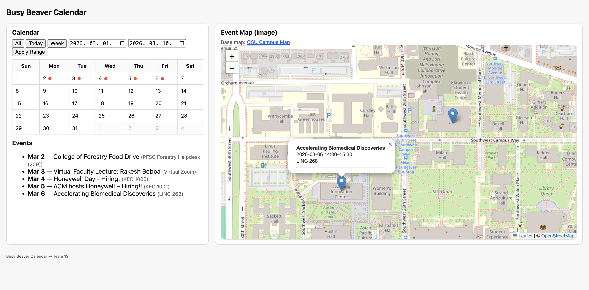

# Busy Beaver Calendar (CS362 Team 19)

Busy Beaver Calendar is a web app for viewing OSU-related events in a calendar and map interface.

## Team

- Sangwoo (Shawn) Park — Leader
- Charley Lotspeich — Project Researcher
- Brian McCarthy — Scheduler / Organizer
- Kyohei Yamaguchi — Quality Assurance Tester

## Project Purpose

The software helps students find events by date and location, then view those events in both:

- a calendar/events list view, and
- an interactive map with event pins.
## Project Purpose

The software helps students find events by date and location, then view those events in both:

- a calendar/events list view, and
- an interactive map with event pins.



### UI Overview

**Left panel — Calendar & Events**
- **All** — Show all events (reset any active filter)
- **Today** — Show only today's events
- **Week** — Show only this week's events
- **Date range inputs + Apply Range** — Enter a custom start/end date and apply the filter
- **Red dot on calendar date** — Indicates that one or more events exist on that date
- **Events list** — Displays filtered events with date, name, and location

**Right panel — Event Map**
- **Map pins** — Shows event locations as pins on the OSU campus map
- **Click a pin** — Opens a popup with event name, date/time, and location
- **+/- buttons** — Zoom in/out on the map

## Beta Operational Use Case(s)

### Use Case 3.4 — Filter Events by Date Range (Operational)

Implemented and integrated across major components:

- Frontend (`templates/index.html`, `static/js/calendar.js`, `static/js/map.js`)
- Backend API (`routes.py`)
- Business/data layer (`event_service.py`, `data_manager.py`)

Behavior supported:

- Preset filters: `All`, `Today`, `Week`
- Custom date range filter: `start` + `end` + `Apply Range`
- Filtered results update:
  - event list,
  - calendar markers/dots,
  - map pins

## Build / Setup Instructions

These steps are enough for course staff and classmates to run and test the system.

### Prerequisites

- Python 3.12+
- Git

### Optional: If Python is not installed

If you do not already have Python, install it first:

- **Windows**
	1. Download Python 3.12+ from https://www.python.org/downloads/
	2. Run installer and check **"Add Python to PATH"**
	3. Open a new PowerShell window and verify:

		 ```powershell
		 python --version
		 ```

- **macOS**
	1. Install Homebrew (if needed): https://brew.sh/
	2. Install Python:

		 ```bash
		 brew install python
		 python3 --version
		 ```

If `python` is not recognized on your machine, use `python3` in the commands below.

### 1) Clone repository

```bash
git clone https://github.com/SSPark04/CS362---Project-Team19.git
cd CS362---Project-Team19
```

### 2) Create and activate virtual environment

#### Windows (PowerShell)

```powershell
python -m venv .venv
.\.venv\Scripts\Activate.ps1
```

#### macOS/Linux

```bash
python3 -m venv .venv
source .venv/bin/activate
```

### 3) Install dependencies

```bash
pip install -r requirements.txt
```

### Troubleshooting

- **pip not found inside venv (Windows):**
  If `pip` is not available after activating the venv, recreate it with `--without-pip` and bootstrap pip manually:

  ```powershell
  python -m venv .venv --without-pip
  .\.venv\Scripts\Activate.ps1
  python -m ensurepip
  pip install -r requirements.txt
  ```

- **`pytest` or `flask` not recognized (macOS):**
  Use `python -m pytest` instead of `pytest`. This ensures the venv Python is used:

  ```bash
  python -m pytest
  ```

## Test Instructions

### Run all automated tests

```bash
pytest
```

If `pytest` is not recognized, use:

```bash
python -m pytest
```

### Run targeted tests for beta use case 3.4

```bash
pytest tests/test_frontend.py tests/test_routes.py
```

## Run Instructions

Start the Flask app from repository root:

```bash
python app.py
```

Then open in a browser:

```text
http://127.0.0.1:5000/
```

## In-Class Beta Test Script 

Use this exact flow during class:

1. Open app in browser at `http://127.0.0.1:5000/`
2. Confirm page shows calendar, event list, and map.
3. Click `Today`:
	- event list updates,
	- calendar updates,
	- map pins update.
4. Click `Week` and verify the same synchronized behavior.
5. Set custom range (`rangeStart`, `rangeEnd`) and click `Apply Range`:
	- only in-range events remain in list/calendar/map.
6. Enter invalid range (start date after end date):
	- error message appears,
	- filter is not applied.
7. Enter a range with no events:
	- list shows `No events found.`,
	- map shows no event pins.

## Known Notes

- If you open `templates/index.html` directly as a file, API-backed features will not work correctly.
- Always run through Flask (`python app.py`) and use the browser URL above.
